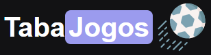
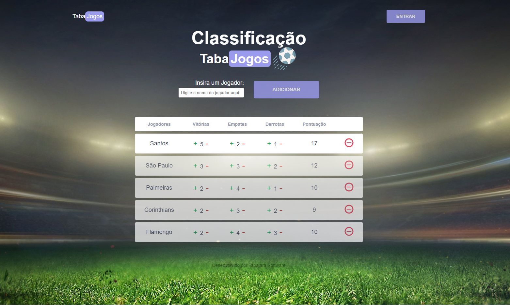

<h1 align="center">
  
</h1>

  <a href="#-tecnologias">Tecnologias</a>&nbsp;&nbsp;&nbsp;|&nbsp;&nbsp;&nbsp;
  <a href="#-projeto">Projeto</a>&nbsp;&nbsp;&nbsp;

 

  

## 🚀 Tecnologias

Projetos desenvolvidos para iniciação nas tecnologias:

- HTML
- CSS
- JavaScript

## 💻 Projeto

A "Tabela de Classificação - TabaJogos" é uma aplicação para controlar a pontuação dos times ou jogadores de um campeonato, onde é possível cadastrar e excluir os times/jogadores participantes, adicionar ou diminuir as pontuações de vitórias, empates e derrotas, com o cálculo da pontuação total.

---

Feito através da [Imersão.dev_](https://imersao.dev/) organizada pela Alura e ministrada pelos instrutores Paulo, Rafaella, e Guilherme.